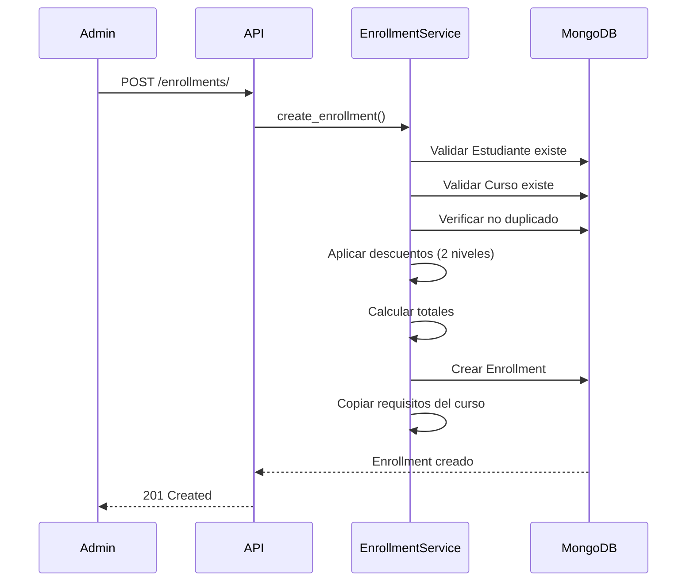
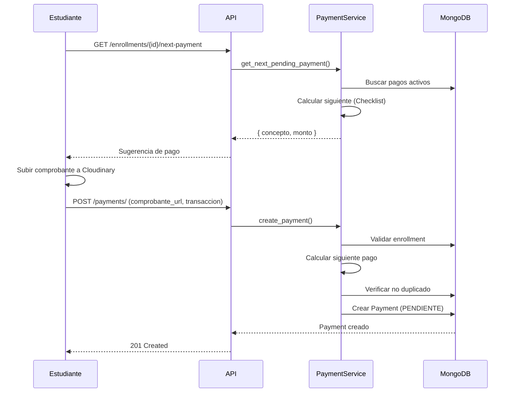
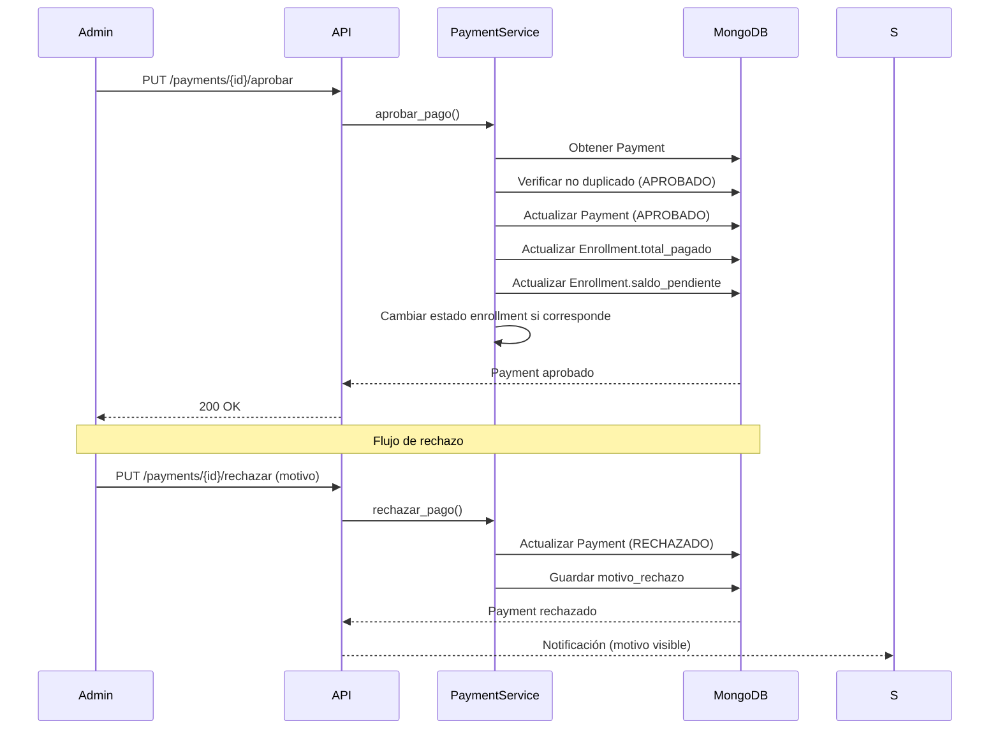
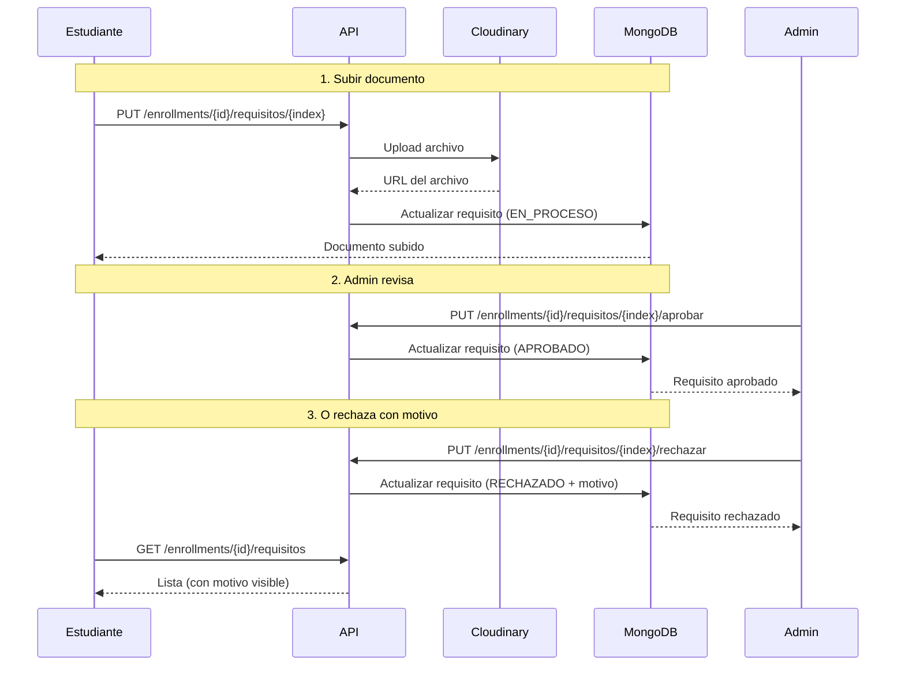
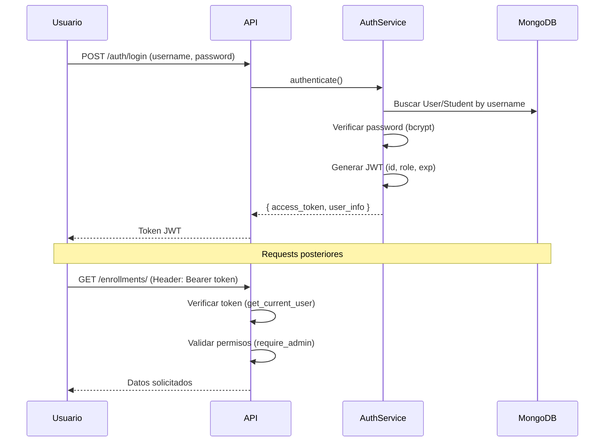
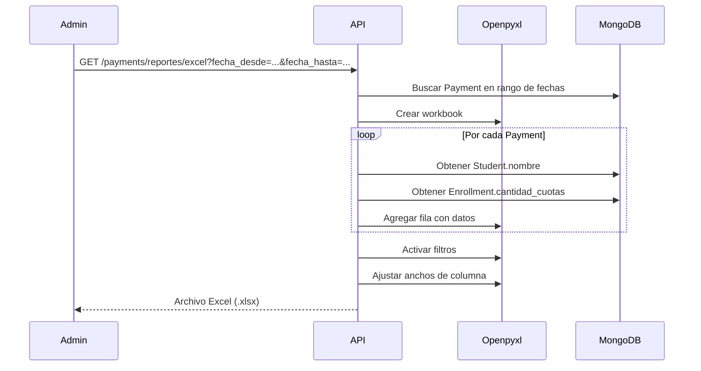

# 📊 Análisis de Flujos del Sistema KyC

**Fecha**: 29 de Diciembre, 2024  
**Versión**: 1.0  
**Propósito**: Documentar flujos principales e identificar falencias

---

## 📑 Índice

1. [Flujo de Inscripciones](#flujo-inscripciones)
2. [Flujo de Pagos](#flujo-pagos)
3. [Flujo de Requisitos](#flujo-requisitos)
4. [Flujo de Autenticación](#flujo-autenticacion)
5. [Flujo de Reportes](#flujo-reportes)
6. [Resumen de Falencias Críticas](#resumen-falencias)

---

## 🎓 Flujo de Inscripciones {#flujo-inscripciones}

### Descripción
Proceso mediante el cual un Admin inscribe a un estudiante en un curso.

### Secuencia

### Estados del Enrollment

| Estado | Descripción | Transición |
|--------|-------------|------------|
| `PENDIENTE_PAGO` | Creado, esperando pago de matrícula | → `ACTIVO` (al aprobar matrícula) |
| `ACTIVO` | Matrícula pagada, curso en marcha | → `COMPLETADO` (al pagar todo) |
| `COMPLETADO` | Pagos finalizados | → `GRADUADO` (manual) |
| `GRADUADO` | Curso aprobado con nota | Estado final |
| `RETIRADO` | Estudiante se retiró | Estado final |
| `SUSPENDIDO` | Admin suspendió | ↔ `ACTIVO` (reversible) |

### ⚠️ Falencias Identificadas

#### 1. **Falta validación de capacidad del curso**
- **Problema**: No se verifica si el curso tiene cupos disponibles
- **Impacto**: Podrían inscribirse más estudiantes de los permitidos
- **Solución**: Agregar campo `capacidad_maxima` en Course y validar en `create_enrollment()`

#### 2. **No hay control de fechas de inscripción**
- **Problema**: Se puede inscribir a un estudiante en un curso que ya empezó o terminó
- **Impacto**: Inscripciones inválidas, problemas administrativos
- **Solución**: Validar `curso.fecha_inicio` y `curso.fecha_fin` antes de crear enrollment

#### 3. **Cambio de estado arbitrario**
- **Problema**: Admin puede cambiar estado sin validaciones (ej: `COMPLETADO` → `PENDIENTE_PAGO`)
- **Impacto**: Inconsistencias financieras, estados ilógicos
- **Solución**: Implementar máquina de estados con transiciones permitidas

#### 4. **Descuentos sin auditoría completa**
- **Problema**: Se registra quién creó el enrollment, pero no quién modificó descuentos posteriormente
- **Impacto**: Falta de trazabilidad en cambios financieros
- **Solución**: Crear log de cambios en campo `historial_descuentos`

---

## 💰 Flujo de Pagos {#flujo-pagos}

### Descripción
Ciclo de vida de un pago desde su creación hasta aprobación/rechazo.

### Secuencia (Estudiante crea pago)

### Secuencia (Admin aprueba/rechaza)

### Estados del Payment

| Estado | Descripción | Acciones permitidas |
|--------|-------------|---------------------|
| `PENDIENTE` | Creado, esperando revisión | Aprobar, Rechazar |
| `APROBADO` | Admin aprobó, dinero contabilizado | Solo consulta |
| `RECHAZADO` | Admin rechazó con motivo | Estudiante puede crear nuevo pago |

### ⚠️ Falencias Identificadas

#### 1. **Falta notificaciones automáticas**
- **Problema**: El estudiante no recibe notificación cuando su pago es aprobado/rechazado
- **Impacto**: Mala UX, estudiante debe revisar manualmente
- **Solución**: Implementar sistema de notificaciones (email/SMS) o WebSockets

#### 2. **No hay timeout para pagos pendientes**
- **Problema**: Un pago puede quedar `PENDIENTE` indefinidamente
- **Impacto**: "Reserva" innecesaria de conceptos (bloquea crear otro pago del mismo concepto)
- **Solución**: Agregar `fecha_expiracion` y job que auto-rechaza pagos antiguos (ej: 72h)

#### 3. **Falta validación de comprobante**
- **Problema**: No se valida que el comprobante sea legible/válido
- **Impacto**: Admins pierden tiempo rechazando comprobantes obviamente inválidos
- **Solución**: OCR básico o validación de calidad de imagen antes de permitir creación

#### 4. **No hay manejo de sobrepagos**
- **Problema**: Si un estudiante paga de más, el sistema no tiene flujo para devolución
- **Impacto**: Dinero "atrapado" en el sistema
- **Solución**: Campo `saldo_a_favor` en Enrollment y endpoint para gestionar devoluciones

#### 5. **Reporte Excel no filtra por estado**
- **Problema**: El reporte incluye TODO (pendientes, rechazados, aprobados)
- **Impacto**: Dificulta análisis financiero real (¿cuánto ingresó realmente?)
- **Solución**: Agregar parámetro `?estado=aprobado` al endpoint de reportes

#### 6. **Falta conciliación bancaria**
- **Problema**: No hay forma de marcar qué pagos fueron efectivamente depositados
- **Impacto**: Posibles fraudes o pagos aprobados sin depósito real
- **Solución**: Campo `conciliado: bool` y fecha de conciliación

#### 7. **Checklist Strategy no considera pagos parciales**
- **Problema**: Si un estudiante paga 200 Bs de una cuota de 500 Bs, el sistema no lo maneja
- **Impacto**: Inflexibilidad en planes de pago
- **Solución**: Permitir campo `pago_parcial: bool` y acumular montos por concepto

---

## 📄 Flujo de Requisitos {#flujo-requisitos}

### Descripción
Gestión de documentos requeridos para formalizar la inscripción.

### Secuencia

### Estados del Requisito

| Estado | Descripción | Siguiente paso |
|--------|-------------|----------------|
| `PENDIENTE` | No subido | Estudiante sube documento |
| `EN_PROCESO` | Subido, esperando revisión | Admin aprueba/rechaza |
| `APROBADO` | Admin aprobó | N/A (final) |
| `RECHAZADO` | Admin rechazó con motivo | Estudiante resube |

### ⚠️ Falencias Identificadas

#### 1. **No hay versionado de documentos**
- **Problema**: Si un estudiante resube, el documento anterior se pierde
- **Impacto**: No hay historial, imposible auditar
- **Solución**: Cambiar `url: str` a `versiones: List[{url, fecha, estado}]`

#### 2. **Falta fecha límite de entrega**
- **Problema**: Requisitos pueden quedarse pendientes indefinidamente
- **Impacto**: Estudiantes "activos" sin documentación completa
- **Solución**: Campo `fecha_limite` por requisito + recordatorios automáticos

#### 3. **No hay validación de tipo de archivo**
- **Problema**: Aunque se sube a Cloudinary, no se valida en backend
- **Impacto**: Podrían subirse archivos ejecutables o no válidos
- **Solución**: Whitelist estricta de MIME types en endpoint

#### 4. **Admin no puede solicitar correcciones sin rechazar**
- **Problema**: Solo hay APROBAR o RECHAZAR, no "CORRECCIÓN MENOR"
- **Impacto**: Flujo binario, poco flexible
- **Solución**: Nuevo estado `REVISION_SOLICITADA` con comentarios del admin

---

## 🔐 Flujo de Autenticación {#flujo-autenticacion}

### Descripción
Sistema de login y control de acceso basado en JWT y roles.

### Roles y Permisos

| Rol | Permisos |
|-----|----------|
| `SUPERADMIN` | Todo (CRUD completo en todos los módulos) |
| `ADMIN` | Gestión de enrollments, pagos, requisitos. NO puede crear otros admins |
| `STUDENT` | Solo sus propios enrollments, pagos, requisitos |

### Secuencia de Login

### ⚠️ Falencias Identificadas

#### 1. **No hay refresh tokens**
- **Problema**: Token expira y usuario debe reloguearse
- **Impacto**: Mala UX, cierre de sesión inesperado
- **Solución**: Implementar refresh token con mayor duración

#### 2. **Falta rate limiting en login**
- **Problema**: Posible ataque de fuerza bruta
- **Impacto**: Seguridad comprometida
- **Solución**: Limitar intentos de login por IP (ej: 5 intentos/minuto)

#### 3. **No hay logout en backend**
- **Problema**: Token sigue siendo válido incluso si el usuario "cierra sesión"
- **Impacto**: Riesgo si el token es robado
- **Solución**: Blacklist de tokens o tokens de corta duración + refresh

#### 4. **Falta autenticación de dos factores (2FA)**
- **Problema**: Solo username/password
- **Impacto**: Vulnerabilidad si la contraseña es comprometida
- **Solución**: Implementar TOTP o SMS para admins

#### 5. **No hay auditoría de accesos**
- **Problema**: No se registran logins exitosos/fallidos
- **Impacto**: Imposible detectar accesos no autorizados
- **Solución**: Tabla `LoginAttempts` con IP, timestamp, resultado

---

## 📈 Flujo de Reportes {#flujo-reportes}

### Descripción
Generación de reportes Excel para análisis financiero.

### Secuencia

### Campos del Reporte

| Columna | Descripción | Fuente |
|---------|-------------|--------|
| Nombre del Estudiante | Nombre completo | `Student.nombre` |
| Fecha | Hora boliviana (UTC-4) | `Payment.fecha_subida - 4h` |
| Moneda | Siempre "Bs" | Hardcoded |
| Monto | Cantidad pagada | `Payment.cantidad_pago` |
| Concepto | "Matrícula" o "Cuota X" | `Payment.concepto` |
| Total Cuotas | Cuotas del curso | `Enrollment.cantidad_cuotas` |
| Nº Transacción | Código del banco | `Payment.numero_transaccion` |
| Estado | pendiente/aprobado/rechazado | `Payment.estado_pago` |
| Descripción | Vacía (reservada) | N/A |

### ⚠️ Falencias Identificadas

#### 1. **Falta filtro por estado en reporte**
- **Problema**: Incluye TODOS los estados (pendientes, rechazados)
- **Impacto**: Datos financieros imprecisos
- **Solución**: Parámetro `?estado=aprobado` y filtrar en query

#### 2. **No hay reportes agregados**
- **Problema**: Solo hay reporte detallado, no resumen
- **Impacto**: Admin debe procesar Excel manualmente
- **Solución**: Endpoint `/reportes/resumen` con totales por curso, estado, etc.

#### 3. **Performance con muchos datos**
- **Problema**: Si hay 10,000 pagos, el Excel tarda mucho
- **Impacto**: Timeout del endpoint
- **Solución**: Paginación o job asíncrono + notificación cuando esté listo

#### 4. **Falta exportación a otros formatos**
- **Problema**: Solo Excel, no CSV ni PDF
- **Impacto**: Limitado para integraciones
- **Solución**: Parámetro `?format=csv` o `?format=pdf`

---

## 🚨 Resumen de Falencias Críticas {#resumen-falencias}

### Prioridad ALTA (Seguridad/Financiero)

| # | Falencia | Módulo | Impacto | Solución Recomendada |
|---|----------|--------|---------|----------------------|
| 1 | **No hay conciliación bancaria** | Pagos | Posibles fraudes | Campo `conciliado` + proceso manual/automático |
| 2 | **Falta rate limiting en login** | Auth | Ataques de fuerza bruta | Middleware de rate limiting (5 intentos/min) |
| 3 | **Cambio de estado sin validación** | Enrollments | Inconsistencias financieras | Máquina de estados con transiciones permitidas |
| 4 | **No hay blacklist de tokens** | Auth | Tokens robados siguen válidos | Redis blacklist o tokens de corta duración |

### Prioridad MEDIA (UX/Operaciones)

| # | Falencia | Módulo | Impacto | Solución Recomendada |
|---|----------|--------|---------|----------------------|
| 5 | **Falta notificaciones** | Pagos | Mala UX | Email/SMS al aprobar/rechazar |
| 6 | **Timeout de pagos pendientes** | Pagos | Conceptos bloqueados | Auto-rechazo después de 72h |
| 7 | **No hay versionado de documentos** | Requisitos | Falta de auditoría | Array de versiones con historial |
| 8 | **Reportes sin filtros** | Reportes | Datos imprecisos | Parámetro `?estado=` |

### Prioridad BAJA (Mejoras futuras)

| # | Falencia | Módulo | Impacto | Solución Recomendada |
|---|----------|--------|---------|----------------------|
| 9 | **No hay 2FA** | Auth | Seguridad mejorable | TOTP para admins |
| 10 | **Falta validación de capacidad** | Enrollments | Sobrecupos | Campo `capacidad_maxima` en Course |
| 11 | **No hay pagos parciales** | Pagos | Inflexibilidad | Permitir montos < monto_cuota |

---

## 🎯 Recomendaciones Generales

### Corto Plazo (1-2 semanas)
1. ✅ Implementar conciliación bancaria
2. ✅ Agregar rate limiting a `/auth/login`
3. ✅ Filtros de estado en reportes Excel
4. ✅ Notificaciones por email (usando servicio externo)

### Mediano Plazo (1 mes)
1. ✅ Refresh tokens + blacklist
2. ✅ Máquina de estados para Enrollments
3. ✅ Timeout automático de pagos pendientes
4. ✅ Versionado de requisitos

### Largo Plazo (3+ meses)
1. ✅ Sistema de notificaciones en tiempo real (WebSockets)
2. ✅ OCR para validación de comprobantes
3. ✅ Dashboard analítico con métricas
4. ✅ Integración con pasarelas de pago (QR bolivianos)

---

## 📝 Notas Finales

Este análisis se basa en el estado actual del código (29 Dic 2024). Las falencias identificadas NO implican que el sistema esté "mal", sino que hay **oportunidades de mejora** para hacerlo más robusto, seguro y fácil de usar.

Priorizar las falencias según:
1. **Riesgo de seguridad** (ALTA prioridad)
2. **Impacto financiero** (ALTA prioridad)
3. **UX del estudiante** (MEDIA prioridad)
4. **Eficiencia operativa** (MEDIA prioridad)
5. **Nice-to-have** (BAJA prioridad)

---

**Elaborado por**: Antigravity AI  
**Revisión**: Pendiente
